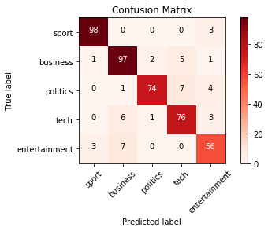

## 簡介
用最新的Keras當作Tensorflow的front-end可以輕鬆架構出NLP的模型。  
例如在BBC news的分類的應用上，要使用第一層為Embedding向量層、第二層為Bidirectional LSTM層、第三層為一般神經元層、第四層為分類總數的softmax層時，只需用以下程式碼即可架構好。[1]  

```python
model = tf.keras.Sequential([
    tf.keras.layers.Embedding(vocab_size, embedding_dim, input_length=max_length),
    tf.keras.layers.Bidirectional(tf.keras.layers.LSTM(embedding_dim)),
    tf.keras.layers.Dense(embedding_dim, activation='relu'),
    tf.keras.layers.Dense(6, activation='softmax')
])
```

## 儲存訓練好的參數和模型
在訓練模型時，可以選擇要一邊訓練同時儲存weights參數或是訓練好後再一次儲存。[2]  
#### (A) 在訓練時儲存參數
需先設定callback並asign到model.fit裡面。    
```python
checkpoint_path = "training_1/cp.ckpt"
checkpoint_dir = os.path.dirname(checkpoint_path)

# Create a callback that saves the model's weights
cp_callback = tf.keras.callbacks.ModelCheckpoint(filepath=checkpoint_path, save_weights_only=True, verbose=1)
# Train the model with the new callback
model.fit(train_images,
          train_labels,  
          epochs=10,
          validation_data=(test_images,test_labels),
          callbacks=[cp_callback])  # Pass callback to training
```
之後同樣架構的模型可以直接讀取參數來用。  
```python
# Loads the weights
model.load_weights(checkpoint_path)
```

#### (B) 在訓練後儲存參數
在訓練好模型後，直接一次儲存所有參數。  
```python
# Save the weights
model.save_weights('./checkpoints/my_checkpoint')
```
之後同樣架構的模型可以直接讀取參數來用。
```python
# Restore the weights
model.load_weights('./checkpoints/my_checkpoint')
```

#### (C) 儲存整個模型
在訓練好模型後，直接儲存整個模型。  
儲存的檔案裡面包括全部的weight values、模型架構、optimizer的設定。
```python
# Save the entire model as a SavedModel.
model.save('saved_model/my_model')
```
之後可以直接讀取模型來用。
```python
new_model = tf.keras.models.load_model('saved_model/my_model')
```

## 畫Confusion Matrix來觀察模型成效
混淆矩陣(confusion matrix)常被拿來參考去判定一個分類模型表現的好不好。  
  
sklearn有提供confusion matrix可直接使用。  
```python
from sklearn.metrics import confusion_matrix
cm = confusion_matrix(validation_label_seq, rounded_predictions)
print(cm)
```
[[98  0  0  0  3]  
 [ 1 97  2  5  1]  
 [ 0  1 74  7  4]  
 [ 0  6  1 76  3]  
 [ 3  7  0  0 56]]  

 另外可用matplotlib來畫出更容易懂得彩色圖。[3]  
```python
import itertools
import matplotlib.pyplot as plt
def plot_confusion_matrix(cm, classes, normalize = False, title = 'Confusion matrix', cmap = plt.cm.Reds):
    plt.imshow(cm, interpolation = 'nearest', cmap = cmap)
    plt.title(title)
    plt.colorbar()
    tick_marks = np.arange(len(classes))
    plt.xticks(tick_marks, classes, rotation = 45)
    plt.yticks(tick_marks, classes)
    plt.ylim([4.5, -0.5]) # solve squished issue

    if normalize:
        cm = cm.astype('float') / cm.sum(axis=1)[:,np.newaxis]
        print("Normalized confusion matrix!")
    else:
        print("Confusion matrix, without normalization")

    print(cm)

    thresh = cm.max()/2
    for i, j in itertools.product(range(cm.shape[0]), range(cm.shape[1])):
        plt.text(j, i , cm[i, j],
                horizontalalignment = "center",
                color = "white" if cm[i, j] > thresh else "black")

    plt.tight_layout()
    plt.ylabel('True label')
    plt.xlabel('Predicted label')
```

## 使用Pre-trained的辭向量
在做NLP應用時常常會使用別人已經訓練好的辭向量來用，在Keras + TF下只要在Embedding層設定weights為預先處理好的embedding matrix即可。  
```python
model = tf.keras.Sequential([
    tf.keras.layers.Embedding(vocab_size+1, embedding_dim, input_length=max_length, weights=[embeddings_matrix], trainable=False),
    tf.keras.layers.Dropout(0.2),
    tf.keras.layers.Conv1D(64, 5, activation='relu'),
    tf.keras.layers.MaxPooling1D(pool_size=4),
    tf.keras.layers.LSTM(64),
    tf.keras.layers.Dense(1, activation='sigmoid')
])
```

## References
[1] https://www.coursera.org/learn/natural-language-processing-tensorflow  
[2] https://www.tensorflow.org/tutorials/keras/save_and_load  
[3] https://stackoverflow.com/questions/57937751/why-does-this-confusion-matrix-matplotlib-look-squished-in-jupyter-notebook  
